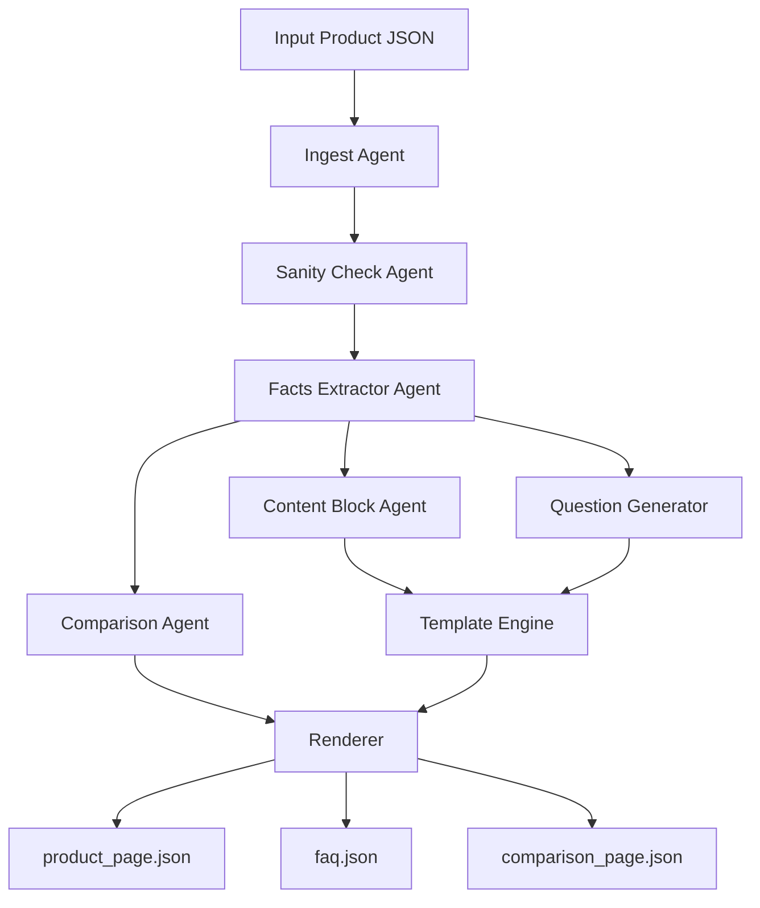

# Project Documentation — Kasparro Applied AI / Agentic Content System

## 1. Problem Statement
The task is to design and implement a deterministic, modular, multi-agent content generation system that takes a **single product JSON** as input and produces **three structured machine-readable outputs**:

1. A product page (`product_page.json`)
2. A FAQ page with ≥15 rule-based Q&As (`faq.json`)
3. A comparison page between Product A and a fictional Product B (`comparison_page.json`)

The system must operate **only on provided input facts**, introduce **no external or invented information**, and follow clear software engineering principles such as modularity, deterministic behavior, maintainability, and testability.  
All outputs must be strictly structured JSON — not prose.

---

## 2. Solution Overview
The solution is built as a **multi-agent deterministic pipeline**, where each agent performs a single responsibility. The system processes the input product through the following stages:

1. **Ingest** – Read and normalize product JSON into an internal model  
2. **Sanity Validation** – Validate schema, fields, and expected formats  
3. **Facts Extraction** – Convert product fields into an atomic fact-bag  
4. **Question Generation** – Rule-based generation of ≥15 questions derived purely from facts  
5. **Content Block Generation** – Modular reusable components such as summary, benefits, ingredients, usage, safety, price  
6. **Template Engine** – Compose content blocks into a structured product page and FAQ page  
7. **Comparison Engine** – Build a fictional Product B deterministically and compute structured comparisons  
8. **Renderer** – Output final JSON files according to required format

The entire system is **fully deterministic** (same input → same output) except for timestamps, and is validated using automated unit tests and an end-to-end pipeline test.

---

## 3. Scopes & Assumptions
### 3.1 In-Scope
- Only one product JSON is processed per run  
- Output must be strictly machine-readable JSON  
- All content must derive explicitly from the input JSON  
- Comparison must involve **one fictional Product B** generated solely from Product A  
- System must remain modular and testable  
- Deterministic rule-based logic (no randomness, no external calls)

### 3.2 Out-of-Scope
- No use of LLMs for natural language content generation  
- No external product knowledge or API calls  
- No UI rendering or web layer  
- No database or persistence layer beyond simple output files  

### 3.3 Assumptions
- Input data follows the assignment-provided structure or equivalent fields  
- Missing optional fields default to deterministic fallback values  
- Product B must be fictional but based strictly on Product A’s structure  
- Ingredient and benefit comparisons preserve original casing for readability  

---

## 4. System Design (Most Important)

The system follows a **deterministic multi-agent architecture** consisting of independent components orchestrated in a pipeline.  
Each agent transforms its input into a predictable output, enabling testability and clear separation of responsibilities.

### 4.1 High-Level Architecture
```bash
Product JSON
│
▼
[Ingest Agent] → normalized ProductModel
│
▼
[Sanity Agent] → validated product + issues
│
▼
[Facts Extractor] → atomic fact bag
│
├──────────────► [Question Generator] → FAQ data
│
├──────────────► [Content Block Agent] → summary, benefits, ingredients, usage, safety, price blocks
│
├──────────────► [Template Engine] → product_page.json, faq.json
│
└──────────────► [Comparison Agent] → fictional product B + comparison JSON
│
▼
[Renderer] → writes structured JSON outputs
```
---

### 4.2 Agent Responsibilities (Conceptual)
This section focuses on *responsibility definitions*, not code-level descriptions.

| Agent | Core Responsibility |
|-------|---------------------|
| **IngestAgent** | Load and normalize input JSON into a canonical internal model |
| **SanityCheckAgent** | Validate required fields, check types, and identify issues |
| **FactsExtractorAgent** | Convert product into atomic fact units for reuse |
| **QuestionGeneratorAgent** | Generate ≥15 rule-based factual questions |
| **ContentBlockAgent** | Build modular reusable content blocks (summary, benefits, usage, etc.) |
| **TemplateEngineAgent** | Assemble blocks into page-level structured JSON |
| **ComparisonAgent** | Build fictional Product B and compute structured A–B differences |
| **RendererAgent** | Write JSON outputs to disk with schema-compliant structure |

Each agent adheres to **single responsibility**, enabling composability and isolation.

---

### 4.3 Deterministic Content Generation
All transformations are **pure, rule-based, and deterministic**:
- No randomness  
- No network calls  
- No LLM-generated text  
- No external facts  
- Same input → identical structured output (timestamps excluded)

---

### 4.4 Product B Generation Logic
Product B is created using **only** Product A’s fields:
- Name modified to indicate "Fictional B"  
- Ingredients: deterministic subset (all except last, if applicable)  
- Benefits: copied exactly  
- Price: increased by +15% (rule-based, deterministic)  

Comparison then evaluates:
- Common ingredients  
- A-only / B-only ingredients  
- Benefit overlap  
- Price difference  
- Final verdict (cheaper / equal / unavailable)

---

### 4.5 Template Engine Design
The template engine composes structured blocks into final JSON pages.  
Example conceptual flow:
```bash
facts
│
├──► summary_block
├──► ingredients_block
├──► benefits_block
├──► usage_block
├──► safety_block
└──► price_block
│
▼
template rules
│
▼
product_page.json (structured, deterministic)

Templates define **order**, **field structure**, and **constraints**.
```
---

### 4.6 Diagrams

#### **Pipeline Sequence Diagram (Mermaid)**



## 5. Future Improvements

-Plugin-based agent registry for more flexible extension

-Configurable comparison strategies (beyond ingredients/price/benefits)

-Support for multiple product inputs in a batch pipeline

-JSON schema validation enforcement at output stage

-More advanced template rules (conditional rendering, prioritization)

-Optional natural-language rewrite layer (still deterministic)

## 6. Closing Notes
This system prioritizes:

-Clarity over complexity

-Determinism over randomness

-Modularity over monolithic logic

-Testability over implicit behavior

The implementation is aligned with Kasparro’s focus on clarity, modularity, and robust AI system design, transcending the limitations of simple automation scripts.