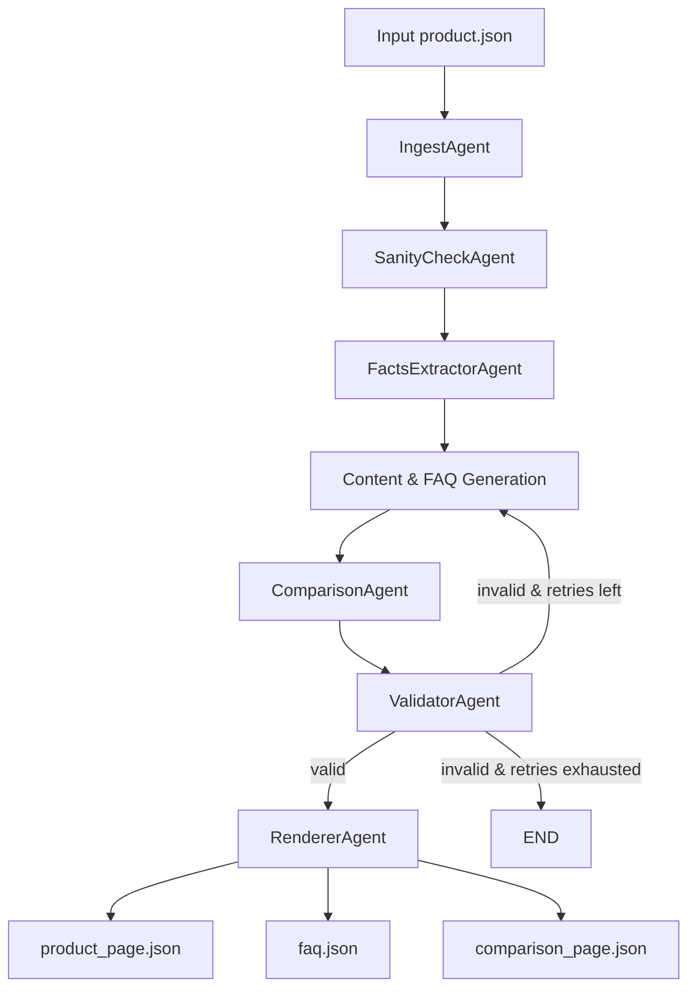

# Project Documentation — Kasparro Applied AI / Agentic Content System

## 1. Problem Statement
The goal of this assignment is to design and implement a modular, deterministic, agentic content generation system that processes a single product JSON and produces three machine-readable JSON outputs:

1.product_page.json — A structured, block-based product description

2.faq.json — At least 15 fact-grounded, rule-based FAQs

3.comparison_page.json — A deterministic comparison between Product A and a fictional Product B

The system must:

- Use only the information explicitly provided in the input JSON

- Guarantee zero hallucinations

- Produce strict JSON output conforming to fixed schemas

- Follow clean, modular AI engineering practices

- Support deterministic reproducibility (same input → same output)

The system must operate **only on provided input facts**, introduce **no external or invented information**, and follow clear software engineering principles such as modularity, deterministic behavior, maintainability, and testability.  
All outputs must be strictly structured JSON — not prose.

---

## 2. Solution Overview
The implemented solution follows a multi-agent pipeline architecture, where each agent performs a single, isolated responsibility.

The final system consists of:

- Deterministic ingest & validation

- Fact extraction into atomic units

- Deterministic content generation using rule-based agents

- Strict JSON templating

- LangGraph-based orchestration with explicit state, routing, and validation gates

- LLM fallback (GPT-4o-mini) only when deterministic agents fail schema constraints

The entire pipeline is coordinated through a central orchestrator (src/graph.py), ensuring:

✔ explicit state transitions
✔ validation-driven retry loops
✔ deterministic-first execution
✔ strict schema compliance
✔ JSON-only outputs
✔ clean modularity

---

## 3. Scopes & Assumptions
### 3.1 In-Scope
- Process exactly one product JSON per run
- Generate three deterministic JSON outputs
- All agents operate in an explainable, rule-based fashion
- No part of the system may hallucinate content
- No external lookups, no dynamic data sources

### 3.2 Out-of-Scope
- Natural language rewriting or creative text generation
- Non-json or free-form output
- UI, interfaces, or deployment
- Batch processing or multi-product handling  

### 3.3 Assumptions
- Input product follows expected key/value patterns
- Missing optional values are replaced by  deterministic defaults
- Product B must be fictional but strictly derived from Product A
- The same input always yields identical outputs (excluding timestamps)

---

## 4. System Design 

The system follows the Single Responsibility Principle, with each agent transforming structured input into structured output. Modular decomposition allows isolated testing and clarity of intent.

### 4.1 High-Level Architecture
```bash
Input Product JSON
│
▼
[Ingest Agent] → canonical normalized structure
│
▼
[Sanity Agent] → validations, issue detection
│
▼
[Facts Extractor] → atomic fact-bag
│
├──► [Content Block Agent] → summary, ingredients, benefits, usage, safety
│
├──► [Question Generator Agent] → exactly 15 deterministic questions
│
├──► [Comparison Agent] → fictional Product B + structured comparison
│
├──► [Validator Agent] → schema enforcement
│       └── retry loop (LangGraph)
│
▼
[Renderer Agent] → writes final JSON artifacts
```
---

### 4.2 Agent Responsibilities (Conceptual)
This section focuses on *responsibility definitions*, not code-level descriptions.

| Agent                      | Core Responsibility                                                                |
| -------------------------- | ---------------------------------------------------------------------------------- |
| **IngestAgent**            | Load and normalize input JSON into a canonical internal model                      |
| **SanityCheckAgent**       | Validate required fields, check types, and identify issues                         |
| **FactsExtractorAgent**    | Convert product into atomic fact units                                             |
| **QuestionGeneratorAgent** | Generate exactly 15 rule-based factual questions                                   |
| **ContentBlockAgent**      | Build deterministic content blocks (summary, ingredients, benefits, usage, safety) |
| **TemplateEngineAgent**    | Assemble blocks into schema-compliant JSON                                         |
| **ComparisonAgent**        | Build fictional Product B and compute structured A–B differences                   |
| **ValidatorAgent**         | Enforce schema validity and trigger retries                                        |
| **RendererAgent**          | Write final JSON outputs to disk                                                   |


Each agent adheres to **single responsibility**, enabling composability and isolation.

---

### 4.3 Deterministic Content Generation
To satisfy requirements, the system avoids:
- randomness
- external knowledge
- free-form LLM content
Every transformation is deterministic, rule-driven, and reversible.

#### Key Deterministic Rules

- Missing fields → deterministic defaults
- LLM usage → fallback only, never primary
- All outputs validated against Pydantic schemas
---

### 4.4 Product B Generation Logic
Product B is created using **only** Product A’s fields

| Field          | Rule                             |
| -------------- | -------------------------------- |
| name           | `A.name + " (Fictional B)"`      |
| ingredients    | All A.ingredients minus the last |
| benefits       | Copy A.benefits exactly          |
| price.amount   | `round(A.amount * 1.15, 2)`      |
| price.currency | Same as A                        |


The comparison output includes:
- A-only ingredients/benefits
- B-only ingredients/benefits
- Price comparison formatted as strings
- A deterministic verdict
---

### 4.5 Template Engine Design
The template engine ensures:

- strict JSON structure

- required titles are always filled (Summary, Usage Instructions, Safety Information)

- no empty required keys

- correct ordering of blocks

- Schema compatibility with validator
---

### 4.6 LangChain Orchestrator — Pipeline Coordinator

The pipeline is orchestrated using LangGraph’s StateGraph, providing:

1. Explicit State

A typed PipelineState shared across agents, containing:

- product

- facts

- generated artifacts

- validation status

- retry counters

2. Validation & Retry Loop

- Outputs are validated by ValidatorAgent

- On failure, the graph loops back to regeneration

- Retries are bounded to prevent infinite loops

3. Deterministic-First Strategy

- Deterministic agents run first

- LLM-based generation is used only as fallback

- All LLM outputs are schema-validated

4. JSON Safety

- Strict JSON-only prompts

- Repair logic for malformed responses

- Final schema enforcement before rendering

## 5 Pipeline Sequence Diagram 



---

## 6. Testing

The project includes comprehensive tests covering:

- Fact extraction

- Question generation

- Content block generation

- Comparison logic

- Template correctness

- End-to-end LangGraph pipeline execution

All tests pass against the LangGraph-based orchestrator.


## 7. Future Improvements

- Plugin-based agent registry

- Configurable comparison strategies

- Batch processing support

- Stronger graph-level retry policies

- Optional deterministic NLP enrichment layer

## 8. Closing Notes
This system prioritizes:

- Clarity over complexity

- Determinism over randomness

- Modularity over monolithic logic

- Testability over implicit behavior

The final implementation demonstrates a true agentic pipeline with explicit state, routing, validation, and retry logic—designed with real-world AI engineering practices in mind.